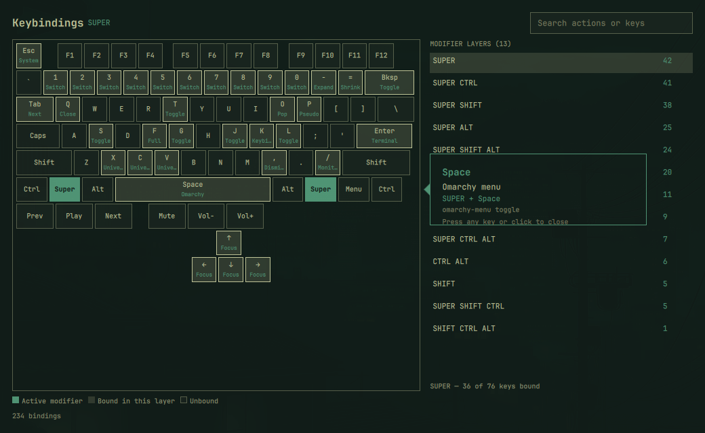

# lemechant.keybindings-editor

A local fork of [Ming-Bao/omarchy-shortcut-visualizer](https://github.com/Ming-Bao/omarchy-shortcut-visualizer)
(`ming.keybindings`) that adds in-panel rebinding on top of the original
read-only visualizer. Diverges from upstream — updates there won't reach
this copy; re-apply the Editing changes below by hand if you ever pull a
newer upstream version.

An Omarchy shell panel that shows your Hyprland keybindings as an
on-screen keyboard. Pick a modifier layer on the right (e.g. `SUPER`,
`SUPER SHIFT`) to highlight every key it binds, with a short label per
key. Click a highlighted key for the full action, key combo, and
underlying command; any keypress or click dismisses that detail card.
Search (top right) filters the keyboard highlighting live.

## Editing

Every binding shows a **Change app**/**Add app** button in the detail
card (labeled "Change app" when it already launches something, "Add
app" when it doesn't — e.g. a core window-manager dispatcher like
`movefocus` or `workspace`): pick a different installed application
(searchable, backed by Quickshell's `DesktopEntries`, launched the same
way Omarchy's own app launcher does: `gtk-launch <id>.desktop`) or type
a web app's name + URL. The key combo stays put; only the action
changes — this works on *any* binding, including core WM ones, so
using it on e.g. `SHIFT + ALT + Tab` (focus previous window) replaces
that action with the app you pick. There's no undo button for this in
the panel; see "Removing a shortcut entirely" below.

Bindings whose action is already a plain command (i.e. `dispatcher ===
"exec"` — covers everything declared via `o.bind(keys, description,
command)`, which is virtually every app-launch/toggle/webapp shortcut)
additionally show a **Rebind** button: click it, press the new shortcut
(must include Super, plus optionally Shift/Ctrl/Alt, plus one letter,
digit, or F-key), and it's applied immediately. Only the key combo
changes; the action stays whatever it already was. Rebind isn't offered
for non-`exec` bindings (it would reinterpret their dispatcher argument,
e.g. `movefocus`'s `l`, as a shell command to preserve — meaningless
outside `exec`).

Clicking an **unbound** key (dashed accent border on hover) opens the
same Application/Web app picker to assign a brand-new shortcut there,
using whichever modifier layer is currently selected (so pick the
`SUPER …` layer you want the new shortcut to live in first) — only
offered when that layer includes Super, since a fresh combo always
needs it.

Deliberately out of scope, to keep this safe:
- Punctuation/symbol/media/arrow keys as the combo being written to —
  only letters, digits, and F1-F12 are accepted, since those are the
  only key names this tool has verified round-trip correctly through
  `hl.bind`/`hl.unbind`.
- Removing a shortcut entirely (going back to fully unbound) — not
  offered yet; hand-edit `bindings.lua` for that (delete the managed
  block bin/keybindings-write left for it, see below).

Edits are written to `~/.config/hypr/bindings.lua` — never to
`/usr/share/omarchy` — as one clearly-marked block per edited key slot
(see `bin/keybindings-write`'s header comment for the exact format).
Identity is by *combo*, not description, so changing the app (which
changes the description) still finds and replaces the same block
instead of leaving an orphaned one behind; a plain Rebind that lands
back on the pristine original combo deletes the block entirely. Every
write is preceded by a timestamped backup of `bindings.lua`, followed
by `hyprctl reload` and a `hyprctl configerrors` check; any error rolls
the file back automatically so a bad edit can't leave your keybindings
broken. Writing to a combo another shortcut already uses is refused
rather than silently shadowing it.



## Install

This fork lives only at `~/.config/omarchy/plugins/lemechant.keybindings-editor/`
(it was never pushed anywhere, so there's no git URL to `omarchy plugin add`).
To reinstall from scratch, copy this whole folder there and enable it:

```
omarchy plugin enable lemechant.keybindings-editor
```

This only registers the plugin with the shell (`kinds: ["panel"]`, so
there's no bar widget or section to place) — it does not touch your
Hyprland config. See **Setup** below for the two small additions that make
it actually usable.

## Setup

Installing the plugin only registers it with the shell — opening it and
getting the right window behavior both need two small additions of your
own, since a plugin's QML can't touch Hyprland config directly.

**1. Add a keybind** to `~/.config/hypr/bindings.lua` (or trigger it any
other way you like — this is just the suggested default):

```lua
o.bind("SUPER + SHIFT + ALT + K", "Visual keybindings", "omarchy-shell shell toggle lemechant.keybindings-editor")
```

Without step 1, you can still open the panel manually:

```
omarchy-shell shell toggle lemechant.keybindings-editor
```

**2. Add a window rule** to `~/.config/hypr/hyprland.lua` so the panel
floats and centers instead of getting tiled like a normal app:

```lua
o.window({ class = "^org.quickshell$", title = "^Keybindings$" }, { float = true, center = true, size = { 1040, 640 } })
```

Colors, spacing, and fonts come from the shell's `Color`/`Style`
singletons, so this follows whatever Omarchy theme is active.

## Removal

```
omarchy plugin remove lemechant.keybindings-editor
```

This deletes the plugin folder and disables it in the shell. It does not
undo the two Setup additions above — remove the `o.bind(...)` line from
`bindings.lua` and the `o.window(...)` rule from `hyprland.lua` yourself
if you added them.

## Dependencies

`bin/keybindings-data` (read path) shells out to `hyprctl`, `xkbcli`
(from `libxkbcommon`), and `jq`/`awk`/`sed`/`bash` — all standard on a
Hyprland/Omarchy install, nothing extra to install. `bin/keybindings-write`
(the Editing write path, this fork's addition) is a `node` script — also
already present on this machine (`mise`-managed) — and itself shells out
to `hyprctl` and to `bin/keybindings-data`.

## License

MIT — see [LICENSE](LICENSE).

## Developing / troubleshooting

Plugin files under `~/.config/omarchy/plugins/` hot-reload on save; force
a reload with `omarchy-shell shell rescanPlugins` if a change doesn't
seem to apply. If the panel renders only partially (or not at all) after
many edits in one long-running session, that's accumulated hot-reload
state in the shell process, not a code defect — run `omarchy-restart-shell`
(a real process restart) and reopen the panel.

## How it gets its data

`bin/keybindings-data` reuses the same `hyprctl binds` + Lua-bind-cache
parsing approach as Omarchy's own `omarchy-menu-keybindings`, but emits
structured JSON (including the dispatcher/command) instead of a
flattened display string. See the header comment in that script for the
reasoning and its known coupling to `hyprctl binds`' text format.

## Tests

```
node --test test/keyboard-layout.test.js test/bindings-data.test.js
bash test/keybindings-data.smoke.sh
```
